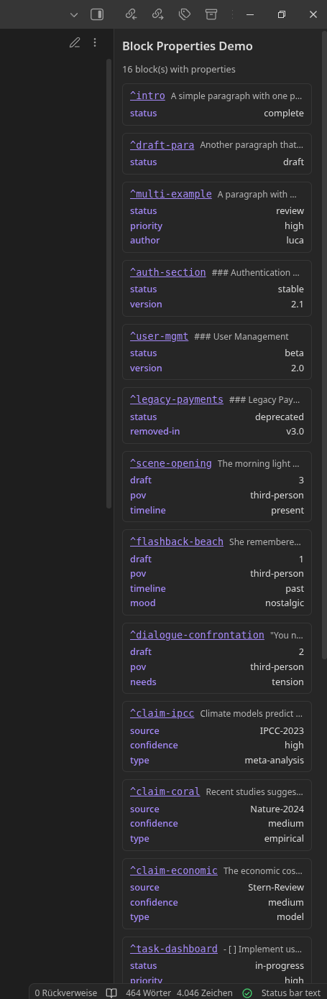

<div align="center">

# Block Properties

**Add metadata to individual blocks in Obsidian**

[](https://github.com/Querulantenkind/obsidian-block-properties-plugin/releases)
[](LICENSE)
[](https://obsidian.md)

*Extend block-ID syntax with inline key-value properties*


</div>

---

## Quick Start

```markdown
Any paragraph with a block ID. ^my-block [status: draft, priority: high]
```

That's it. Properties appear after the block ID in `[key: value]` format.

---

## The Problem

Obsidian's properties exist only at the note level. But knowledge isn't atomic — notes contain structure, and that structure carries meaning:

- **Documentation**: Some sections are stable, others deprecated, others experimental
- **Long-form writing**: Different passages have different states, POVs, timelines
- **Research**: Claims from different sources have different confidence levels

Currently, there's no way to attach metadata below the note level without fragmenting your content into separate files.

## The Solution

Block Properties extends Obsidian's block-ID syntax to support inline metadata:

```markdown
This section is stable. ^api-docs [status: stable, version: 2.0]

This needs review. ^draft-section [status: draft, reviewer: pending]
```

## Features

### Core Features

- **Inline Syntax**: Natural extension of existing `^block-id` syntax
- **Two Display Modes**:
  - *Inline*: Properties shown as dimmed text
  - *Badge*: Compact numbered badge
- **Hover Tooltips**: See all properties at a glance
- **Reading View Support**: Properties visible in both edit and reading mode
- **Query Command**: Find all blocks with specific properties across your vault

### Property Panel

- **Sidebar View**: Shows all block properties in the current note
- **Inline Editing**: Click any value to edit it directly
- **Quick Navigation**: Click block IDs to jump to that location
- **Property Summary**: See which keys are used and how often

### Autocomplete & Templates

- **Smart Suggestions**: Keys and values based on your existing properties
- **Property Templates**: Reusable presets for common property combinations
- **Auto-expand**: Type `preset: task` and it expands to the full template

### Linked Properties <sup>NEW in v1.0.2</sup>

- **Note Links**: Reference other notes with `[[Note]]` syntax
- **Block References**: Link to other blocks with `^block-id` syntax
- **Click Navigation**: Click links in the panel or Cmd/Ctrl+Click in the editor
- **Backlink Tracking**: See which blocks reference the current block
- **Link Autocomplete**: Type `[[` for notes or `^` for block suggestions

---

## Linked Properties

**New in v1.0.2**: Property values can now contain links to notes and blocks, enabling relationship tracking between blocks.

### Syntax

```markdown
Note links:
^task-1 [status: active, docs: [[Project Documentation]]]

Block references:
^subtask [status: blocked, blocked-by: ^parent-task]

Mixed content:
^feature [spec: [[Design Doc]], depends: ^api-refactor, status: planned]
```

### Navigation

Links in property values are fully interactive:

| Location | Action |
|----------|--------|
| Property Panel | Click on any link to navigate |
| Editor | `Cmd/Ctrl + Click` on a link |
| Hover Tooltip | Links are highlighted for visibility |

### Backlinks

The Property Panel includes a **"Referenced by"** section that shows which blocks link to each block in the current file:

```
^parent-task [status: in-progress]

Referenced by:
  → subtask-1 (blocked-by)
  → subtask-2 (depends-on)
```

This creates a bidirectional relationship view without leaving the current note.

### Autocomplete for Links

When typing property values, the autocomplete system recognizes link syntax:

- Type `[[` → Shows notes from your vault
- Type `^` → Shows block IDs from your vault

Select a suggestion to insert the complete link syntax.

### Use Cases for Linked Properties

#### Task Dependencies

```markdown
^setup-database [status: done, type: infrastructure]

^implement-api [status: in-progress, depends-on: ^setup-database]

^write-tests [status: blocked, blocked-by: ^implement-api]
```

#### Cross-Reference Documentation

```markdown
^api-endpoint [method: POST, spec: [[API Specification]], changelog: [[v2.0 Release Notes]]]
```

#### Research Connections

```markdown
^hypothesis-a [status: supported, evidence: ^experiment-1, contradicts: ^old-theory]

^experiment-1 [date: 2024-01, supports: ^hypothesis-a, methodology: [[Research Methods]]]
```

#### Content Relationships

```markdown
^chapter-3 [status: draft, continues: ^chapter-2, foreshadows: ^chapter-7]
```

---

## Property Panel


*The Property Panel shows all blocks with properties in the current note*

### Panel Features

- **Block Overview**: See all blocks with their properties at a glance
- **Context Preview**: Shows the text before each block ID for easy identification
- **Quick Navigation**: Click any block ID to jump to that line
- **Inline Editing**: Click any value to modify it with dropdown suggestions
- **Add/Delete**: Add new properties or remove existing ones
- **Summary Section**: Statistics on property key usage
- **Backlinks Section**: Shows incoming references (when linked properties are enabled)

### Inline Editing

1. **Click** on any property value to start editing
2. **Dropdown** appears with suggestions from your vault
3. **Enter** to save, **Escape** to cancel
4. Changes are immediately written to the file

---

## Property Templates

Define reusable property sets in Settings for common patterns:

```
Template: "task"
Properties: status: todo, priority: medium, assignee: (empty)

Template: "documentation"
Properties: status: draft, version: 1.0, reviewed: false
```

### Using Templates

**Via Command**: Use "Insert property template" to open a picker modal

**Via Autocomplete**: Type `preset: ` in a property value:
```markdown
^new-task [preset: task]
```
With auto-expand enabled, this becomes:
```markdown
^new-task [status: todo, priority: medium, assignee: ]
```

---

## Syntax Reference

### Basic Syntax

```markdown
^block-id [key: value]
^block-id [key1: value1, key2: value2, key3: value3]
```

### With Links (v1.0.2+)

```markdown
^block-id [ref: [[Note Name]]]
^block-id [depends: ^other-block]
^block-id [docs: [[Folder/Note]], blocked-by: ^task-1]
```

### Whitespace

```markdown
^id[key:value]           ✓ Works (no spaces)
^id [key: value]         ✓ Works (spaces around brackets)
^id [ key : value ]      ✓ Works (spaces inside)
```

### Special Characters

```markdown
^id [message: Hello, World]     ✗ Comma splits properties
^id [message: Hello World]      ✓ No comma in value
^id [url: https://example.com]  ✓ Colons in values are fine
```

---

## Commands

| Command | Description |
|---------|-------------|
| `Insert block property` | Add a block property template at cursor |
| `Insert property template` | Choose from saved templates to insert |
| `Query block properties` | Search for blocks by property key/value |
| `Open property panel` | Show sidebar with all properties in current note |

---

## Settings

| Setting | Description |
|---------|-------------|
| **Display** | |
| Display Mode | `Inline` (dimmed text) or `Badge` (compact icon) |
| Property Color | Color for property text |
| Opacity | Transparency level (0.1 - 1.0) |
| **Linked Properties** | |
| Enable linked properties | Allow `[[Note]]` and `^block-id` in values |
| Show backlinks in panel | Display "Referenced by" section |
| **Templates** | |
| Auto-expand presets | Automatically expand `preset: name` to full template |
| Property Templates | Create, edit, and delete reusable property sets |

---

## Installation

### Manual Installation

1. Download the latest release from [GitHub Releases](https://github.com/Querulantenkind/obsidian-block-properties-plugin/releases)
2. Extract `main.js`, `manifest.json`, and `styles.css` to `.obsidian/plugins/block-properties/`
3. Enable the plugin in Obsidian settings

### BRAT (Beta Reviewer's Auto-update Tool)

1. Install the BRAT plugin
2. Add `Querulantenkind/obsidian-block-properties-plugin`
3. Enable Block Properties

### From Source

```bash
git clone https://github.com/Querulantenkind/obsidian-block-properties-plugin.git
cd obsidian-block-properties-plugin
npm install
npm run build
```

---

## Use Cases

### Technical Documentation

```markdown
## Authentication API ^auth-api [status: stable, version: 2.0, spec: [[API Spec]]]

## Legacy Endpoints ^legacy [status: deprecated, removed-in: v3.0, migration: [[Migration Guide]]]
```

### Project Management

```markdown
Implement dashboard redesign. ^task-1 [status: in-progress, priority: high, assignee: luca]

Fix login bug. ^task-2 [status: blocked, blocked-by: ^task-1, issue: [[Bug Reports#login]]]

Write documentation. ^task-3 [status: pending, depends-on: ^task-1, output: [[User Guide]]]
```

### Creative Writing

```markdown
The sun rose slowly. ^scene-1 [draft: 2, pov: narrator, timeline: present]

She remembered that summer. ^flashback-1 [draft: 1, pov: maria, timeline: past, continues: ^scene-1]
```

### Research Notes

```markdown
Smith (2023) argues for X. ^cite-1 [type: journal, supports: ^hypothesis-a, pdf: [[Papers/Smith2023]]]

Johnson (2022) contradicts this. ^cite-2 [type: book, contradicts: ^hypothesis-a, notes: [[Reading Notes#johnson]]]
```

### Knowledge Management

```markdown
^concept-entropy [domain: physics, related: ^concept-thermodynamics, explained: [[Physics/Entropy]]]

^concept-thermodynamics [domain: physics, parent: ^concept-entropy, applications: [[Engineering/Heat Engines]]]
```

---

## FAQ

**Q: How is this different from YAML frontmatter properties?**
A: Frontmatter applies to the entire note. Block Properties apply to individual paragraphs, lists, or sections within a note.

**Q: Do block properties work with Dataview?**
A: Not yet. Dataview integration is on the roadmap. Currently, use the built-in Query command to search properties.

**Q: Can I use block properties without a block ID?**
A: No. The syntax requires a block ID (`^block-id`) before the properties. This ensures each block remains linkable.

**Q: Will this break my existing block references?**
A: No. Standard block IDs (`^block-id`) work exactly as before. Properties are purely additive.

**Q: Do linked properties create actual Obsidian links?**
A: The links are recognized and navigable within the plugin, but they don't appear in Obsidian's native backlinks pane. The plugin maintains its own backlink index.

**Q: Can I link to blocks in other files?**
A: Yes! Block references (`^block-id`) search across your entire vault. The first matching block is used.

**Q: What happens if a linked note or block doesn't exist?**
A: Navigation will fail with a "not found" notice. The property value is preserved as-is.

---

## Limitations

- **No nested properties**: Values are plain strings, no objects or arrays
- **Single line only**: Properties must be on the same line as the block ID
- **No Dataview integration**: Queries are plugin-internal only (for now)
- **No mobile testing**: Should work, but not extensively tested on mobile
- **Comma in values**: Commas split properties, so values cannot contain commas
- **Backlinks are plugin-only**: Don't appear in Obsidian's native backlinks

---

## Roadmap

- [ ] Dataview integration (API for external queries)
- [ ] Property inheritance (section → subsection)
- [ ] Typed properties (date picker, number validation)
- [ ] Export/import properties
- [ ] Bulk editing (change all `status: draft` to `status: review`)
- [ ] Conditional styling (highlight based on property values)
- [x] ~~Linked properties~~ *(Added in v1.0.2)*

---

## Changelog

### v1.0.2 — Linked Properties

- **New**: Note links in property values (`[[Note]]`)
- **New**: Block references in property values (`^block-id`)
- **New**: Clickable links in property panel
- **New**: Cmd/Ctrl+Click navigation in editor
- **New**: Backlink tracking with "Referenced by" section
- **New**: Autocomplete for notes and block IDs
- **New**: Settings for linked properties feature

### v1.0.1 — Templates & Panel Editing

- **New**: Property templates with auto-expand
- **New**: Inline editing in property panel
- **New**: Add/delete properties from panel

### v1.0.0 — Initial Release

- Block property syntax
- Display modes (inline/badge)
- Property panel
- Query command
- Autocomplete

---

## Contributing

Contributions welcome! Please open an issue first to discuss major changes.

## License

[MIT](LICENSE)

## Credits

Developed with the help of Claude Code.

---

<div align="center">

If you find this plugin useful, consider starring the repository!

**[GitHub](https://github.com/Querulantenkind/obsidian-block-properties-plugin)** · **[Codeberg](https://codeberg.org/Krampus/obsidian-block-properties-plugin)**

</div>
